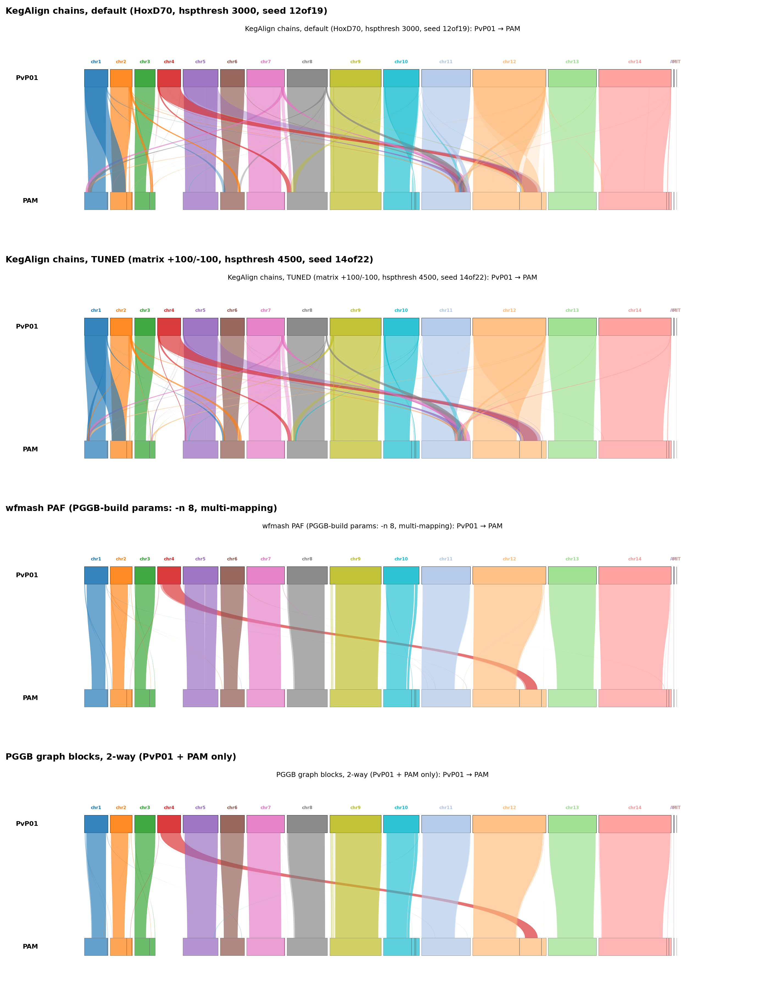

# Alignments, graphs, and orthologs I: building a two-genome pangenome of *Plasmodium vivax*

*Anton Nekrutenko — BRC-analytics blog, post #1*

## Introduction

BRC-analytics builds comparative genomic resources for the eukaryotic pathogens covered by the NIH BRCs—pangenome graphs, multiple genome alignments, orthologous groups, codon-aware alignments of protein-coding regions, and the projections that tie these layers together. This post opens a series describing how each resource is produced and what it is useful for. We start with the data-type that sits underneath everything else, the pangenome graph, and we use *Plasmodium vivax*—the first species for which BRC-analytics comparative resources will appear—as the working example. Here, we walk through the construction of a sequence-based pangenome from two assemblies, PvP01 and PAM, as a warm-up to the eight-genome graph that anchors the rest of the *P. vivax* track.

## What is a pangenome?

A pangenome is the union of sequences and structural variation across a set of related genomes, encoded as a graph in which nodes are sequence intervals and edges are the observed connections between them. Two camps dominate the current toolchain. The first—sequence-based graphs built by PGGB (Garrison et al., Nat Methods 2024) [2]—treats every input assembly symmetrically and lets all-versus-all alignments determine the topology. The second—Minigraph-Cactus (Hickey, Paten et al., Nat Biotechnol 2024) [3]—starts from a designated reference and adds non-reference structural variation on top, drawing on the genome-inference framework Paten and colleagues laid out (Paten et al., Genome Res 2017) [1]. Minigraph (Li 2020) [6] is the structural-variation engine that Minigraph-Cactus is built around.

The two strategies fit different organisms. Minigraph-Cactus shines when there is an undisputed canonical reference and the divergence among inputs is modest—the human pangenome being the textbook case, with the GRCh38/T2T-CHM13 backbone tracking a known common ancestor and structural variants layered onto that scaffold. *Plasmodium* sits at the other extreme. The *P. vivax* assemblies we work with span isolates collected on four continents, the subtelomeres carry rapidly evolving multi-gene families—*pir*, *vir*, PHIST—that resist single-reference framing, and no curated common ancestor exists to hang the variation on. PGGB's reference-free, symmetric design fits this regime: every assembly contributes paths through the graph on equal footing, and the all-pairs wfmash step captures divergence between subtelomeric families without forcing them onto a single backbone.

## The data

We use two assemblies for this two-way warm-up, both bp-identical between PlasmoDB and GenBank releases:

**PvP01** (GCA_900093555.2) is the modern primary reference for *P. vivax*. It was assembled by Auburn et al. (2016) [4] from a Papua, Indonesia isolate using long-read sequencing aimed specifically at the subtelomeric *pir* family. The assembly totals 29.0 Mb across 242 contigs and carries the community-curated PlasmoDB annotation that we use as the source for Liftoff projections later in the series.

**PAM** (GCA_949152365.1) is a 28-contig, 29.4 Mb chromosome-scale assembly of the Madagascar Pv01-19 isolate published by De Meulenaere et al. (2023) [5]. PAM is the cleanest non-reference *P. vivax* assembly currently available—nearly all chromosomes resolve as single contigs—and it gives the graph a high-quality second haplotype to define shared backbone against.

Two genomes is not a pangenome in any biological sense; the eight-way graph that follows in later posts is. We use two here because the alignments and graph are small enough to inspect by eye, which makes the difference between alignment representations and a graph representation easy to see. Both assemblies were hard-masked with the union of sdust and longdust low-complexity calls before being fed into PGGB, matching the masking applied to the full eight-way build.

## Constructing the pangenome

### Alignments

A PGGB pangenome begins with all-versus-all pairwise alignments. The aligner is wfmash, which uses MashMap to pre-filter candidate orthologous segments by their k-mer-based mash distance and then computes base-pair alignments only for segments that pass the threshold. The pre-filter is the load-bearing step—it keeps the all-pairs problem tractable and discards seed extensions that would never reach a useful alignment score. For the two-way graph we used PGGB-build parameters, including `-n 8` so that each query segment is permitted up to eight competing mappings, the same setting we use for the eight-way build so the warm-up matches downstream behavior.

The output is a sparse, high-confidence map: the mash pre-filter removes most of the noise before any base-level alignment is attempted, and every ribbon you see corresponds to a segment that survived the distance threshold.

How does this compare to traditional pairwise aligners? KegAlign is a GPU-accelerated lastZ that we run with two parameter sets:

The default KegAlign run (panel 1) carries visibly more cross-chromosome ribbon traffic than the wfmash panel: lastZ extends every seed that clears its threshold, which at default settings includes a fair number of subtelomeric repeats and *pir*-family hits that connect non-orthologous regions across chromosomes. The tuned run (panel 2) tightens the scoring matrix to +100/-100, raises the HSP threshold to 4500, and lengthens the seed to 14-of-22, and the cross-chromosome chatter drops accordingly. Yet even tuned KegAlign produces denser anchors than wfmash, because lastZ scoring rewards every extendable seed while wfmash discards sub-threshold mash distances before any extension happens. Both behaviors are legitimate—the dense lastZ chains are what you want when you are projecting genome-wide coordinates with chainNet/CrossMap and need every alignable base accounted for, while the sparse wfmash output is what you want when feeding a graph builder that will collapse repeated sequence anyway.

### Graph construction

PGGB threads the wfmash alignments through seqwish, which builds an initial induced graph from the PAF, and then smoothxg, which normalizes the graph by re-aligning short windows to collapse equivalent paths. The output is an ODGI file: a graph in which each input assembly traces a path and shared sequence collapses into a common backbone.

The subway map is the simplest 1D view of what PGGB produces. The long gray tube is the chromosome-1 backbone shared by both PvP01 and PAM; the blue segments are stretches that PvP01 carries but PAM does not, and the orange dashes mark the reciprocal—regions where PAM diverges or where the assembly gap leaves PAM uncovered. The bulk of chromosome 1 is shared, as we would expect for two assemblies of the same species, with most of the divergence concentrated in the subtelomeres at both ends.

The same graph can be "expanded" back into a ribbon view by extracting each contiguous block of shared nodes and plotting it as an alignment block:

This is the same graph as the subway map, projected back into the pairwise-alignment idiom. The two-way graph yields 256 alignment blocks across the full genome (`writeup/synteny_2way/PvP01_to_PAM_2way.blocks.tsv`). Compared to the wfmash PAF in panel 3, the graph-derived blocks are a strict subset—every block corresponds to a stretch of graph nodes traversed by both samples—and the cross-chromosomal hits visible in the wfmash panel are absent here. The graph build has resolved each multi-mapping region to a single canonical placement.

### Why bother?

A pairwise alignment and a graph encode much of the same information; the question is what each makes easy.

Pairwise chains are the right object when you need coordinate projection between two named assemblies. Build a chain file from the KegAlign axt output with axtChain and chainStitchId, hand it to CrossMap or liftOver, and any BED, GFF, or VCF in source coordinates lands in target coordinates in one pass. This is the workflow we use for the v3 VCF projection that lifts the 1,895-sample MalariaGEN Pv4 cohort from PvP01 onto seven other strains. The strength is operational: chains are pairwise, directional, and tool support is mature.

Graphs are the right object when you need every assembly aligned at once and you want structural variation, SNPs, and short indels in a single coordinate system. `odgi position` translates a coordinate on any path to a node in the graph and back out to a coordinate on any other path, which gives you the eight-way equivalent of a chain in one call. `vg deconstruct` walks the graph and emits a VCF in which every bubble—from a single SNP up to a multi-kilobase structural variant—is a variant record, with all samples genotyped against the chosen reference path.

A concrete example is *dhps* (PVP01_1429500 on chromosome 14), the dihydropteroate-synthase gene that carries the sulfadoxine resistance markers tracked across *P. vivax* surveillance. In the pairwise view, *dhps* sits inside one of the 256 alignment blocks—a single chain entry between PvP01 chromosome 14 and the corresponding PAM contig, with the resistance-associated codons identifiable as mismatches in the chain. In the graph view, the same gene is a path through a contiguous run of shared nodes; the codons that distinguish PvP01 from PAM become small bubbles in that path, and any future assembly added to the graph automatically receives its own *dhps* path without re-running a pairwise alignment. The same logic applies to *dhfr-ts* (PVP01_0526600) on chromosome 5 and to every other core-genome marker tracked for antimalarial resistance.

The trade-off is that graphs are denser to construct, harder to inspect locally, and tooling for downstream genetics is younger than the chain/liftOver ecosystem. For BRC-analytics we maintain both representations precisely because each carries the other's blind spots: chains for projection-heavy workflows that consumers already know how to script against, the graph for the cross-genome variant catalog and for any analysis that needs to see all assemblies simultaneously.

In the next post we expand from two genomes to the full eight-way *P. vivax* pangenome and walk through what changes—and what does not—when you add six more isolates spanning four continents.

## Tools used

- PGGB (https://github.com/pangenome/pggb)
- wfmash (https://github.com/waveygang/wfmash)
- seqwish (https://github.com/ekg/seqwish)
- smoothxg (https://github.com/pangenome/smoothxg)
- odgi (https://github.com/pangenome/odgi)
- vg (https://github.com/vgteam/vg)
- KegAlign (https://github.com/galaxyproject/KegAlign)
- lastZ (https://github.com/lastz/lastz)
- CrossMap (https://crossmap.sourceforge.net/)
- Liftoff (https://github.com/agshumate/Liftoff)
- sdust and longdust (https://github.com/lh3/sdust, https://github.com/lh3/longdust)

## References

1. Paten B, Novak AM, Eizenga JM, Garrison E. Genome graphs and the evolution of genome inference. Genome Res. 2017;27(5):665-676. DOI: 10.1101/gr.214155.116
2. Garrison E, Guarracino A, Heumos S, Villani F, Bao Z, Tattini L, et al. Building pangenome graphs. Nat Methods. 2024;21(11):2008-2012. DOI: 10.1038/s41592-024-02430-3
3. Hickey G, Monlong J, Ebler J, Novak AM, Eizenga JM, Zhou Y, et al. Pangenome graph construction from genome alignments with Minigraph-Cactus. Nat Biotechnol. 2024;42(4):663-673. DOI: 10.1038/s41587-023-01793-w
4. Auburn S, Böhme U, Steinbiss S, Trimarsanto H, Hostetler J, Sanders M, et al. A new *Plasmodium vivax* reference sequence with improved assembly of the subtelomeres reveals an abundance of pir genes. Wellcome Open Res. 2016;1:4. DOI: 10.12688/wellcomeopenres.9876.1
5. De Meulenaere K, Cuypers WL, Rovira-Vallbona E, Ramirez A, Brouwer W, Snounou G, et al. The PAM *Plasmodium vivax* reference assembly from a Madagascar isolate (Pv01-19). 2023.
6. Li H, Feng X, Chu C. The design and construction of reference pangenome graphs with minigraph. Genome Biol. 2020;21(1):265. DOI: 10.1186/s13059-020-02168-z
